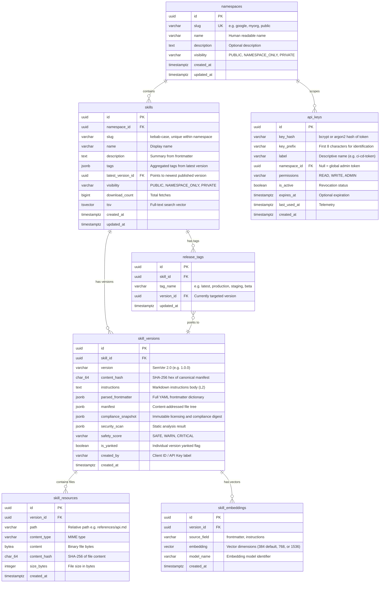
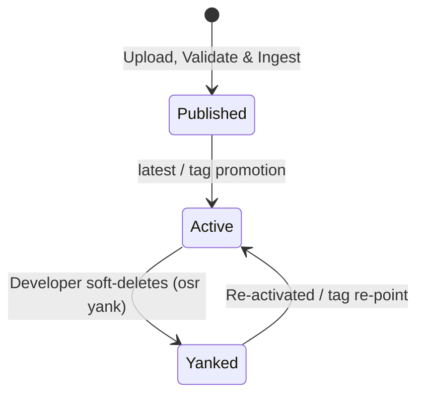

# Data Model: Open Skill Registry

**Feature**: Open Skill Registry  
**Branch**: `001-open-skill-registry`  
**Date**: 2026-09-26  
**License**: Apache-2.0  

## Entity-Relationship Diagram

---

## Entity Specifications

### 1. `Namespace`
Represents an organizational partition for skills.
- **Constraints**:
  - `slug`: unique, lowercase alphanumeric with hyphens, 1-64 characters.
  - `public` namespace is pre-seeded on database initialization.
- **Visibility Levels**:
  - `PUBLIC`: Skills in this namespace are searchable and fetchable by any client without authentication.
  - `NAMESPACE_ONLY`: Skills are discoverable and fetchable only by clients presenting an API key with access to this namespace.
  - `PRIVATE`: Skills require explicit write/admin role within the namespace.

### 2. `Skill`
Represents a capability package identity.
- **Constraints**:
  - Unique composite index on `(namespace_id, slug)`.
  - `slug`: kebab-case, 1-64 characters (`^[a-z0-9]+(-[a-z0-9]+)*$`).
  - `tsv`: Generated column configured for superior syntactic discovery with heavy weighting: `setweight(to_tsvector('english', coalesce(name, '')), 'A') || setweight(to_tsvector('english', coalesce(slug, '')), 'A') || setweight(to_tsvector('english', coalesce(description, '')), 'B')`. Ranking uses `ts_rank_cd` with weights `'{0.1, 0.2, 0.4, 1.0}'` prioritizing Name/Slug (A: 1.0) and Description (B: 0.4) over background content. Aggregated tags in `skills.tags` are indexed via a dedicated GIN index for exact and partial tag matching.

### 3. `SkillVersion`
An immutable release snapshot of a skill.
- **Constraints**:
  - Unique composite index on `(skill_id, version)`.
  - Version format: Semantic Versioning 2.0 (`MAJOR.MINOR.PATCH[-PRERELEASE]`).
  - `content_hash`: Exactly 64 hexadecimal characters representing the SHA-256 digest of the canonical sorted manifest JSON.
  - `safety_score`: Must be one of 'SAFE', 'WARN', 'CRITICAL'.
  - `security_scan`: JSON object detailing static analysis findings (e.g., prompt-injection heuristics, unsafe shell scripts).
  - **Immutability Guarantee**: Once inserted, `content_hash`, `instructions`, `manifest`, and `parsed_frontmatter` are never modified. Only `is_yanked` may be updated.

### 4. `SkillResource`
Stores individual resource files (`references/`, `assets/`, `scripts/`) directly within the database.
- **Constraints**:
  - Unique composite index on `(version_id, path)`.
  - `path`: Normalized POSIX relative path, no leading slashes, no `../` traversal elements.
  - Maximum size: 1MB per individual resource file.
  - The original `SKILL.md` file is stored as a `skill_resource` with `path = 'SKILL.md'` to ensure manifest hash verification consistency. The `instructions` and `parsed_frontmatter` fields on `skill_versions` are derived/parsed copies for efficient querying.

### 5. `SkillEmbedding`
Stores dense vector representations for semantic search.
- **Constraints**:
  - pgvector `vector(384)` by default (for local FastEmbed `BAAI/bge-small-en-v1.5`), `vector(768)` (for Gemini/Ollama), or `vector(1536)` (for OpenAI).
  - Index: HNSW or IVFFlat index on `embedding vector_cosine_ops`.
  - When `provider: none` is configured in `osr.config.yaml`, embedding generation is skipped and the search pipeline operates purely against the `skills.tsv` full-text index.

### 6. `ReleaseTag`
A mutable pointer resolving a channel label to an immutable version.
- **Constraints**:
  - Unique composite index on `(skill_id, tag_name)`.
  - Reserved system tag: `latest` (automatically assigned to the newest non-yanked version).

### 7. `ApiKey`
Authentication credential for CLI and SDK access.
- **Constraints**:
  - Raw keys format: `osr_live_<random_base62_32_chars>`.
  - Only the salted cryptographic hash (`key_hash`) and prefix are stored in PostgreSQL.

---

## State Transitions

### Skill Version Lifecycle

- **Publishing Transition**:
  1. Receive incoming files / standalone `SKILL.md` / directory.
  2. Parse frontmatter, validate constraints (allowed extensions, max sizes, no traversal).
  3. Run static security scanner for prompt-injection and dangerous shell scripts, generating safety score.
  4. Determine version (explicit → frontmatter → auto-increment patch).
  5. Compute per-file SHA-256 hashes and build canonical manifest.
  6. Store files in `skill_resources`, create `skill_versions` record.
  7. Trigger background or inline vector embedding generation (using default local FastEmbed model or configured provider).
  8. Update `latest` tag on parent `skills` record.

---

## Deployment Modes & Unified Configuration

The core schema supports both delivery modes without schema alteration, configured via `osr.config.yaml`:
- **Hosted Mode**: PostgreSQL database holds all 7 tables; `api_keys` manages tokens; Redis provides caching; FastAPI server provides HTTP/REST and Web UI.
- **Embedded Library Mode (`SkillRegistry`)**:
  - Connects directly to PostgreSQL with `pgvector` extension via SQLAlchemy/asyncpg, or to SQLite for lightweight embedded usage.
  - Pluggable vector store & local FastEmbed model (zero API keys).
  - In single-user embedded mode, `api_keys` checking is bypassed (`auth_enabled: false`).
  - Table definitions, manifest calculation, and packaging logic remain 100% identical.
