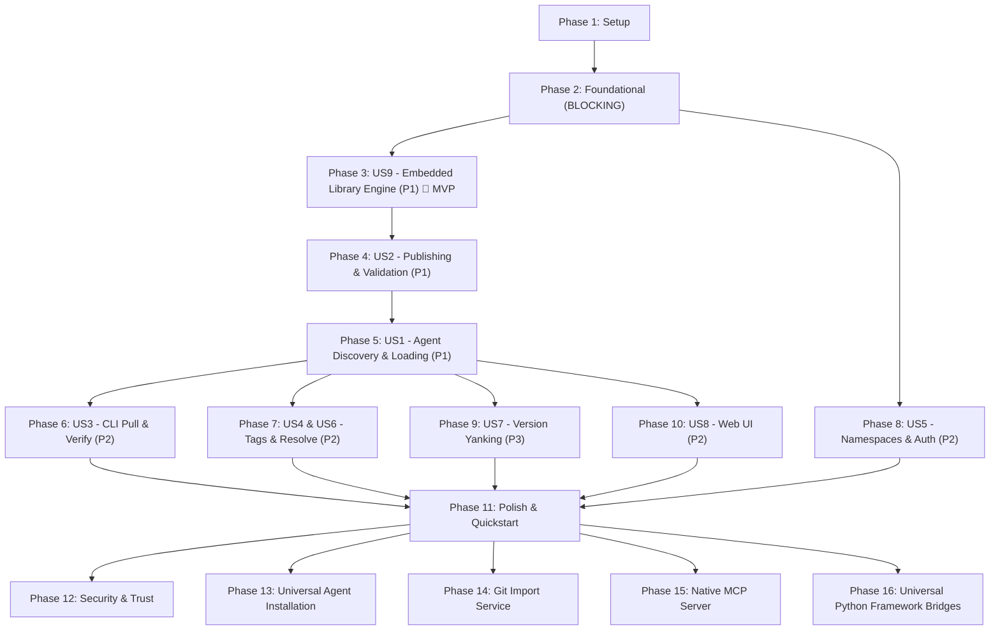

# Implementation Tasks: Open Skill Registry

**Feature**: Open Skill Registry  
**Branch**: `001-open-skill-registry`  
**License**: Apache-2.0  
**Input Specs**: [`spec.md`](./spec.md), [`plan.md`](./plan.md), [`data-model.md`](./data-model.md), [`contracts/`](./contracts/), [`research.md`](./research.md), [`quickstart.md`](./quickstart.md)

---

## Phase 1: Setup (Shared Infrastructure & Environment)

**Purpose**: Project initialization, package scaffolding, and build tooling

- [x] T001 Initialize Python project layout with `pyproject.toml` specifying `[project]`, dependencies (`fastapi`, `uvicorn`, `sqlmodel`, `sqlalchemy[asyncio]`, `asyncpg`, `aiosqlite>=0.20.0`, `pgvector`, `fastembed>=0.3.0`, `numpy>=1.24.0`, `pyyaml>=6.0.1`, `redis`, `typer`, `rich`, `httpx`, `pydantic>=2.8.0`), and optional extras (`[cli]`, `[server]`, `[all]`)
- [x] T002 [P] Configure development tooling: `ruff`, `mypy`, `pytest`, `pytest-asyncio`, and test configuration in `pyproject.toml`
- [x] T003 [P] Create local container orchestration in `docker-compose.yml` (PostgreSQL 16 with pgvector extension, Redis 7, and development server)
- [x] T004 [P] Create production multi-stage container build in `Dockerfile` for the registry server
- [x] T005 Create Alembic migration scaffolding in `src/open_skill_registry/server/db/migrations/` and `alembic.ini`
- [x] T006 [P] Implement unified environment configuration loader in `src/open_skill_registry/config.py` (`RegistryConfig`, `SearchConfig`, `DatabaseConfig`, `StorageConfig`, `ServerConfig`) supporting `osr.config.yaml` / `.osr/config.yaml` / dict, and create canonical `osr.config.yaml` template file in project root

---

## Phase 2: Foundational (Blocking Prerequisites)

**Purpose**: Core data schemas, database migrations, cryptographic CAS hashing, and package safety validation that MUST be complete before ANY user story can proceed

**⚠️ CRITICAL**: Blocks all user stories

- [x] T007 Implement shared Pydantic response envelope and pagination models in `src/open_skill_registry/models/response.py` (`ResponseEnvelope[T]`, `Page[T]`)
- [x] T008 [P] Implement shared manifest models in `src/open_skill_registry/models/manifest.py` (`FileManifestEntry`, `SkillManifest`, with schema version "1.0")
- [x] T009 [P] Implement shared skill frontmatter and metadata DTOs in `src/open_skill_registry/models/skill.py` (`SkillFrontmatter`, `SkillSummary`, `SkillDetail`, `ComplianceSnapshot`)
- [x] T010 Implement canonical CAS manifest hashing engine in `src/open_skill_registry/registry/core/manifest.py` computing deterministic SHA-256 over sorted file entries
- [x] T011 [P] Implement package safety validator in `src/open_skill_registry/registry/core/validator.py` enforcing allowed extensions (`.md`, `.txt`, `.json`, `.yaml`, `.yml`, `.py`, `.sh`, `.ts`, `.js`, `.png`, `.jpg`, `.svg`), per-file limit (1MB default), total package limit (10MB default), and path traversal prevention (`../` and leading `/`)
- [x] T012 Implement SQLModel / SQLAlchemy ORM entities in `src/open_skill_registry/server/db/models.py`:
  - `Namespace`: `id` UUID PK, `slug` unique varchar(64), `name`, `description`, `visibility` ("PUBLIC", "NAMESPACE_ONLY", "PRIVATE")
  - `Skill`: `id` UUID PK, `namespace_id` FK, `slug` varchar(64), `name`, `description`, `tags` JSONB, `visibility`, `download_count` bigint, `tsv` tsvector generated column weighted `setweight(name, 'A') || setweight(slug, 'A') || setweight(description, 'B')`
  - `SkillVersion`: `id` UUID PK, `skill_id` FK, `version` SemVer 2.0 varchar, `content_hash` char(64), `instructions` text, `parsed_frontmatter` JSONB, `manifest` JSONB, `compliance_snapshot` JSONB, `is_yanked` bool, `created_by` varchar
  - `SkillResource`: `id` UUID PK, `version_id` FK, `path` varchar, `content_type` varchar, `content` bytea, `content_hash` char(64), `size_bytes` int
  - `SkillEmbedding`: `id` UUID PK, `version_id` FK, `source_field` varchar, `embedding` vector(384/768/1536), `model_name` varchar
  - `ReleaseTag`: `id` UUID PK, `skill_id` FK, `tag_name` varchar, `version_id` FK
  - `ApiKey`: `id` UUID PK, `key_hash` varchar, `key_prefix` varchar(8), `label` varchar, `namespace_id` FK nullable, `permissions` varchar ("READ", "WRITE", "ADMIN"), `is_active` bool
- [x] T013 Create initial Alembic migration in `src/open_skill_registry/server/db/migrations/versions/001_initial_schema.py` creating `vector` extension, all 7 tables, GIN indexes on `tsv` and `tags`, HNSW index on `embedding`, and pre-seeding `public` namespace
- [x] T014 Implement async database session engine and lifecycle in `src/open_skill_registry/server/db/session.py`
- [x] T015 [P] Implement Redis caching and ETag revalidation helper in `src/open_skill_registry/server/services/cache_service.py` with graceful fallback when Redis is unavailable
- [x] T016 [P] Implement default local ONNX embedding provider using FastEmbed (`BAAI/bge-small-en-v1.5`, 384-dim, 0 API keys) and pluggable adapters in `src/open_skill_registry/registry/embeddings/` (`base.py`, `fastembed.py`, `gemini.py`, `openai.py`, `ollama.py`, `huggingface.py`, `none.py`)
- [x] T017 Implement basic FastAPI app factory, error handlers, and health route in `src/open_skill_registry/server/app.py` and `src/open_skill_registry/server/routes/health.py` (`GET /health`)
- [x] T018 [P] Implement CLI foundation, configuration loader (`osr.config.yaml` / `~/.osr/config.yaml`), and setup commands in `src/open_skill_registry/cli/` (`main.py`, `config.py`, `commands/init.py`, `commands/serve.py`) supporting 1-second `osr init` scaffolding

**Checkpoint**: Foundation ready — database schema, CAS hashing, and basic server/CLI structure initialized.

---

## Phase 3: User Story 9 - Developer Uses Registry as an Embedded In-Process Library (Priority: P1) 🎯 Core Library Engine

**Goal**: Deliver the in-process Python library (`from open_skill_registry import SkillRegistry`) allowing developers to connect directly to their database and embeddings without running an HTTP server (inspired by Mem0).

**Independent Test**: Execute a standalone Python script that initializes `SkillRegistry(config=...)`, publishes a skill, and queries it with zero HTTP network calls.

### Tests for User Story 9
- [x] T019 [P] [US9] Unit test for manifest hashing and validation in `tests/unit/test_manifest.py` and `tests/unit/test_validator.py`
- [x] T020 [P] [US9] Integration test for embedded library engine `SkillRegistry` across both SQLite in-memory and PostgreSQL testcontainers in `tests/integration/test_embedded_registry.py`

### Implementation for User Story 9
- [x] T021 [US9] Implement base storage provider contract in `src/open_skill_registry/registry/storage/base.py` defining async methods (`save_skill_version`, `get_skill_version`, `search_skills`, `resolve_version`, `tag_version`, `yank_version`)
- [x] T022 [US9] Implement storage backends in `src/open_skill_registry/registry/storage/`: PostgreSQL + pgvector backend in `pgvector.py` and SQLite + in-process vector cosine similarity/FTS5 backend in `sqlite.py` implementing the storage contract with SQLAlchemy async sessions and aiosqlite
- [x] T023 [US9] Implement `SkillRegistry` and `AsyncSkillRegistry` facade in `src/open_skill_registry/registry/main.py` orchestrating storage, embeddings, manifest generation, and version resolution
- [x] T024 [US9] Export `SkillRegistry`, `AsyncSkillRegistry`, and `RegistryConfig` from `src/open_skill_registry/__init__.py`

**Checkpoint**: Embedded library works in pure Python with zero server dependencies.

---

## Phase 4: User Story 2 - Developer Publishes a Skill Package with Security & Validation (Priority: P1) 🎯 Supply Side

**Goal**: Enable publishing skills (single `SKILL.md`, raw folders, batch imports, zip archives) with package safety checks, version inference, CAS manifests, and immutable persistence.

**Independent Test**: Run `osr push ./sample-skill/ --namespace myorg --version 1.0.0` or call `POST /api/v1/skills/publish` and verify version immutability (409 on duplicate) and safety rejections (400 on `../`).

### Tests for User Story 2
- [x] T025 [P] [US2] Contract test for `POST /api/v1/skills/publish` in `tests/contract/test_publish_endpoint.py` (valid publish, duplicate 409, traversal rejection 400)
- [x] T026 [P] [US2] Unit test for version inference logic (frontmatter vs patch auto-increment) in `tests/unit/test_version_inference.py`

### Implementation for User Story 2
- [x] T027 [US2] Implement skill publishing and version ingestion service in `src/open_skill_registry/server/services/skill_service.py` (parse `SKILL.md`, extract `references/`, `assets/`, `scripts/`, infer version per FR-028, store `SKILL.md` as resource per data model, compute manifest hash, assign `latest` tag)
- [x] T028 [US2] Implement `POST /api/v1/skills/publish` endpoint in `src/open_skill_registry/server/routes/skills.py` handling multipart uploads (single file, directories, zip bundles) and enforcing security constraints (FR-018, FR-021)
- [x] T029 [US2] Implement `osr push` command in `src/open_skill_registry/cli/commands/push.py` supporting standalone file, local directory, zip archive, and `--batch` multi-skill upload

**Checkpoint**: Developers can publish skills via CLI and HTTP API with full validation and immutability guarantees.

---

## Phase 5: User Story 1 - Agent Discovers and Loads Skills On-Demand (Priority: P1) 🎯 Core Agent Capability

**Goal**: Enable AI agents and clients to perform hybrid semantic/keyword search and incrementally load skills (L1 frontmatter → L2 instructions → L3 on-demand resources).

**Independent Test**: Use ADK `OpenSkillRegistry` or REST API to search `"query optimization"`, verify ranked results, fetch L2 markdown, and stream an L3 resource via `/file?path=...`.

### Tests for User Story 1
- [x] T030 [P] [US1] Contract test for search, version detail, instructions, and file streaming endpoints in `tests/contract/test_retrieval_endpoints.py`
- [x] T031 [P] [US1] Integration test for Google ADK `SkillToolset` with `OpenSkillRegistry` in `tests/adk/test_adk_integration.py`

- [x] T032 [US1] Implement search service in `src/open_skill_registry/server/services/search_service.py` featuring hybrid search: default local FastEmbed ONNX model (`BAAI/bge-small-en-v1.5`, 384-dim, 0 API keys) blended with PostgreSQL `ts_rank_cd(tsv, query, 32)` weighted `'{0.1, 0.2, 0.4, 1.0}'` prioritizing Name/Slug (A: 1.0) and Description (B: 0.4) via Reciprocal Rank Fusion (RRF), with graceful pure syntactic fallback when `provider: none` (FR-003, FR-004)
- [x] T033 [US1] Implement search and retrieval endpoints in `src/open_skill_registry/server/routes/skills.py`:
  - `GET /api/v1/skills/search` (hybrid search with `q`, `limit`, `namespace`)
  - `GET /api/v1/skills` (paginated list with `sort` by `updated`, `downloads`, `name`)
  - `GET /api/v1/skills/{namespace}/{slug}` (overview and tags)
  - `GET /api/v1/skills/{namespace}/{slug}/versions/{version}` (L1 frontmatter + manifest + compliance snapshot)
  - `GET /api/v1/skills/{namespace}/{slug}/versions/{version}/instructions` (L2 markdown)
  - `GET /api/v1/skills/{namespace}/{slug}/versions/{version}/file?path={relpath}` (L3 query-param safe resource streaming)
- [x] T034 [US1] Implement hosted HTTP client in `src/open_skill_registry/client/main.py` (`SkillRegistryClient` and `AsyncSkillRegistryClient`) wrapping the REST API endpoints
- [x] T035 [US1] Implement Google ADK adapter `OpenSkillRegistry` in `src/open_skill_registry/adk.py` supporting both embedded mode (`registry=...`) and hosted mode (`endpoint=...`) with error handling per `adk-contract.md`

**Checkpoint**: Full end-to-end agent discovery and L1/L2/L3 loading functional across both hosted and embedded modes.

---

## Phase 6: User Story 3 - Developer Searches and Pulls Skills Locally with Fingerprint Verification (Priority: P2)

**Goal**: Enable CLI users to search, inspect skill metadata, pull packages to local disk, and verify bit-for-bit integrity against the SHA-256 manifest.

**Independent Test**: Run `osr search "..."`, `osr info <ns>/<slug>`, `osr pull <ns>/<slug>`, and `osr verify ./downloaded/` confirming all file hashes match.

### Tests for User Story 3
- [x] T036 [P] [US3] Unit and CLI test for `osr search`, `osr info`, `osr pull`, and `osr verify` in `tests/unit/test_cli_commands.py`

### Implementation for User Story 3
- [x] T037 [US3] Implement `osr search` command in `src/open_skill_registry/cli/commands/search.py` displaying formatted table or JSON results
- [x] T038 [US3] Implement `osr info` command in `src/open_skill_registry/cli/commands/info.py` displaying metadata, tags, and version history
- [x] T039 [US3] Implement `osr pull` command in `src/open_skill_registry/cli/commands/pull.py` following the 5-step pull algorithm, streaming individual files to `.agents/skills/` or custom directory, and verifying local hashes
- [x] T040 [US3] Implement `osr verify` command in `src/open_skill_registry/cli/commands/verify.py` checking local directory files against remote or local release manifest

**Checkpoint**: Developers can search, inspect, pull, and cryptographically verify skills via CLI.

---

## Phase 7: User Story 4 & 6 - Release Tags & Deterministic Version Resolution (Priority: P2)

**Goal**: Support mutable release tags (`latest`, `production`, `staging`) and deterministic `/resolve` and tag shortcut endpoints.

**Independent Test**: Create versions `1.0.0` and `1.1.0`, point `production` tag to `1.0.0`, query `GET .../tags/production` and `/resolve?tag=production`, move tag to `1.1.0`, and verify resolution updates immediately.

### Tests for User Stories 4 & 6
- [x] T041 [P] [US4, US6] Contract test for tag management and `/resolve` endpoints in `tests/contract/test_tags_and_resolve.py`

### Implementation for User Stories 4 & 6
- [x] T042 [US4, US6] Implement tag mutation and resolution endpoints in `src/open_skill_registry/server/routes/skills.py`:
  - `PUT /api/v1/skills/{namespace}/{slug}/tags/{tag}` (assign tag to version)
  - `GET /api/v1/skills/{namespace}/{slug}/tags/{tag}` (shortcut resolution returning version detail)
  - `GET /api/v1/skills/{namespace}/{slug}/resolve` (deterministic lookup by hash, version, or tag)
- [x] T043 [US4] Implement `osr tag` command in `src/open_skill_registry/cli/commands/tag.py` for CLI channel promotion

**Checkpoint**: Release channels and deterministic resolution endpoints operate consistently.

---

## Phase 8: User Story 5 - Enterprise Namespace Scoping & Multi-Tier Visibility (Priority: P2)

**Goal**: Implement dual-mode authentication (Open vs Secured), namespace CRUD, API key lifecycle management, and visibility filtering (`PUBLIC`, `NAMESPACE_ONLY`, `PRIVATE`).

**Independent Test**: Enable `AUTH_ENABLED=true`, verify unauthenticated search excludes `NAMESPACE_ONLY` skills, verify namespace API key can discover and read private skills, and verify 403 when publishing across namespaces.

### Tests for User Story 5
- [x] T044 [P] [US5] Contract test for auth middleware, namespace scoping, and API key management in `tests/contract/test_auth_and_namespaces.py`

### Implementation for User Story 5
- [x] T045 [US5] Implement authentication middleware in `src/open_skill_registry/server/middleware/auth.py` supporting `AUTH_ENABLED` toggle, Bearer token extraction, and bootstrap admin key via `OSR_ADMIN_KEY` env var
- [x] T046 [US5] Implement API key issuance, listing, and revocation routes in `src/open_skill_registry/server/routes/auth.py` (`POST /api/v1/keys`, `GET /api/v1/keys`, `DELETE /api/v1/keys/{id}`)
- [x] T047 [US5] Implement namespace CRUD routes in `src/open_skill_registry/server/routes/namespaces.py` (`POST`, `GET`, `GET /{slug}`, `PUT /{slug}`)
- [x] T048 [US5] Implement `osr login` and `osr namespace` commands in `src/open_skill_registry/cli/commands/login.py` and `src/open_skill_registry/cli/commands/namespace.py`
- [x] T049 [US5] Add visibility filtering clauses (`PUBLIC` vs matching namespace API key) into search and retrieval queries across `skill_service.py` and `search_service.py`

**Checkpoint**: Enterprise governance, token scoping, and visibility security boundaries fully operational.

---

## Phase 9: User Story 7 - Developer Yanks a Faulty Version (Priority: P3)

**Goal**: Allow soft-deleting faulty versions while propagating warnings and excluding yanked versions from search.

**Independent Test**: Call `DELETE .../versions/1.0.0` or run `osr yank`, verify search excludes version, verify explicit fetch returns `is_yanked: true` and `X-Skill-Warning: Yanked` header.

### Tests for User Story 7
- [x] T050 [P] [US7] Contract test for version yanking in `tests/contract/test_yank_endpoint.py`

### Implementation for User Story 7
- [x] T051 [US7] Implement version yanking route in `src/open_skill_registry/server/routes/skills.py` (`DELETE /api/v1/skills/{namespace}/{slug}/versions/{version}`) setting `is_yanked=true` and injecting warning headers
- [x] T052 [US7] Implement `osr yank` command in `src/open_skill_registry/cli/commands/yank.py`

**Checkpoint**: Soft-deletion and warning propagation functional.

---

## Phase 10: User Story 8 - Developer Uses Web UI for Skill Discovery and Uploads (Priority: P2)

**Goal**: Deliver a built-in lightweight Web UI served directly by FastAPI for visual catalog exploration, search, and drag-and-drop file/folder/zip uploads.

**Independent Test**: Open browser at `http://localhost:8080/`, perform live search, and drag & drop a `SKILL.md` to publish.

### Implementation for User Story 8
- [x] T053 [P] [US8] Create HTML5 catalog and upload view in `src/open_skill_registry/server/static/index.html` with catalog grid, search bar, and drag-and-drop zone
- [x] T054 [P] [US8] Create modern styles in `src/open_skill_registry/server/static/styles.css`
- [x] T055 [US8] Implement client-side search, markdown rendering, and drag-and-drop multipart upload in `src/open_skill_registry/server/static/app.js`
- [x] T056 [US8] Mount static assets and index route at root `/` in `src/open_skill_registry/server/app.py`

**Checkpoint**: Web UI catalog browsing and drag-and-drop uploading operational with zero separate frontend container build.

---

## Phase 11: Polish, Validation & Cross-Cutting Concerns

**Purpose**: System integration, documentation verification, and end-to-end quickstart execution

- [x] T057 [P] Execute and verify the complete `quickstart.md` validation workflow (Section 2 Minimal Setup, Section 3 Embedded Library, Section 4 Hosted Registry, Section 5 CLI, Section 6 Web UI, Section 7 ADK Agent, Section 8 Automated Tests)
- [x] T058 [P] Add README and packaging metadata in `pyproject.toml` and project root
- [x] T059 Run full test suite with testcontainers (`pytest tests/`) validating unit, integration, contract, and ADK adapter suites

---

## Phase 12: Security & Trust

**Purpose**: Enhance registry safety by statically analyzing skill content for vulnerabilities.

- [x] T060 [P] Implement tests for AST/Regex security scanner in `tests/unit/test_security_scanner.py`
- [x] T061 Implement `src/open_skill_registry/registry/security/scanner.py` (AST/Regex for shell injections, prompt overrides, secrets)
- [x] T062 Update publish endpoint to run scan and save `safety_score`
- [x] T063 Implement `osr scan` CLI command

---

## Phase 13: Universal Agent Installation

**Purpose**: Seamlessly install skills into developer workspaces.

- [x] T064 [P] Implement tests for workspace auto-detection and installation commands in `tests/unit/test_installer.py`
- [x] T065 Implement `osr install` and `osr update` CLI commands with workspace auto-detection (`.cursor`, `.claude`, `.agents`)
- [x] T066 Implement `osr list --installed` CLI command

---

## Phase 14: Git Import Service

**Purpose**: Direct import of skills from git repositories.

- [x] T067 [P] Implement tests for Git Import Service in `tests/unit/test_git_import.py`
- [x] T068 Implement `src/open_skill_registry/registry/git_import.py`
- [x] T069 Implement `osr import` CLI command

---

## Phase 15: Native MCP Server

**Purpose**: Provide an MCP interface to the skill registry for agents.

- [x] T070 [P] Implement tests for native MCP server in `tests/contract/test_mcp_server.py`
- [x] T071 Implement `src/open_skill_registry/server/mcp/` supporting SEP-2640 `skills/list`, `skills/get`, `resources/read`
- [x] T072 Implement stdio MCP support via `osr mcp` CLI
- [x] T073 Implement SSE MCP support via `/mcp/sse` endpoints

---

## Phase 16: Universal Python Framework Bridges

**Purpose**: Allow popular Python agent frameworks to directly consume registry skills.

- [x] T074 [P] Implement tests for framework bridges in `tests/unit/test_framework_bridges.py`
- [x] T075 Implement `src/open_skill_registry/adapters/langchain.py` and `openai.py`
- [x] T076 Implement `src/open_skill_registry/adapters/crewai.py`

---

## Dependencies & Execution Order

### Phase Dependencies

### Critical Path & MVP Strategy
- **Minimal Viable Product (MVP)**: Phases 1 → 2 → 3 → 4 → 5.
  - Delivers both Embedded Library (`SkillRegistry`) and Hosted Server (`open_skill_registry.server`), full publishing pipeline, CAS manifest hashing, hybrid search, and the Google ADK adapter.
- **Enterprise & Distribution Milestone**: Phases 6, 7, 8, 9, 10.
  - Adds CLI local synchronization (`osr pull/verify`), release channels (`osr tag`), enterprise namespaces & API keys (`osr namespace/login`), version yanking, and the built-in Web UI.

---

## Parallel Execution Opportunities

- **Phase 1**: T002, T003, T004, T006 can run in parallel.
- **Phase 2**: T008, T009, T011, T015, T016, T018 can execute concurrently once T007 is drafted.
- **User Story 9**: T019, T020 tests run in parallel before implementation.
- **User Story 2**: T025, T026 contract/unit tests run in parallel.
- **User Story 1**: T030, T031 contract/ADK tests run in parallel.
- **User Story 8 (Web UI)**: T053 (HTML) and T054 (CSS) can be authored in parallel.
- **Phases 12-16**: Can be executed concurrently after Phase 11.

---

## Summary Metrics

- **Total Tasks**: 76
- **Setup & Foundational**: 18 tasks (T001–T018)
- **User Stories**: 38 tasks (T019–T056 across 9 user stories)
- **Polish & E2E Validation**: 3 tasks (T057–T059)
- **Extended Features**: 17 tasks (T060–T076)
- **Format Verification**: 100% of tasks follow the `- [ ] TXXX [P?] [US?] Description with file path` format.
